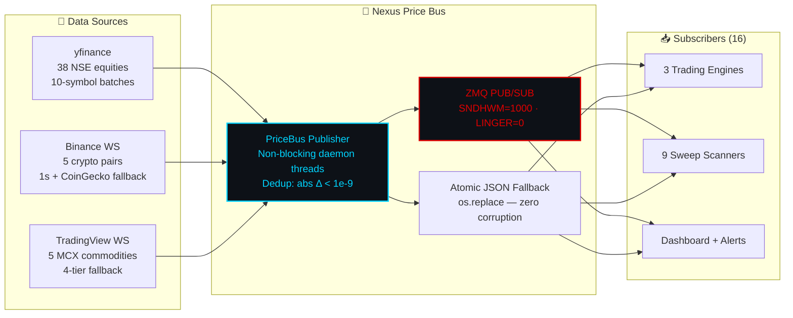

 

 

  

*Sole-authored by **[Ridhaant Ajoy Thackur](https://github.com/Ridhaant)** · Extracted from [AlgoStack](https://github.com/Ridhaant/AlgoStack)*

---

## ⚡ What Is nexus-price-bus?

A production-tested ZeroMQ PUB/SUB multi-source financial price bus that normalises ticks from **NSE equity (yfinance), MCX commodities (TradingView WS), and Binance crypto (WebSocket)** — distributing to 16 concurrent subscribers with **zero data loss** via dual-transport (ZMQ + atomic JSON).

---

## 📊 Specifications

| Metric | Value | Status |
|:---|:---|:---:|
| **Concurrent subscribers** | 16 processes | 🟢 LIVE |
| **ZMQ endpoint** | `tcp://127.0.0.1:28081` | 🟢 LIVE |
| **Topics** | `equity`, `crypto`, `commodity`, `all` | 🟢 LIVE |
| **SNDHWM** | 1000 (backpressure) | ✅ PROD |
| **LINGER** | 0 (no socket hang on close) | ✅ PROD |
| **Dedup threshold** | abs delta < 1e-9 | ✅ PROD |
| **Fallback** | Atomic JSON (write-to-.tmp + os.replace) | ✅ PROD |

---

## 🏗️ Architecture

### Key Classes

| Class | Role |
|:---|:---|
| `PriceBus` | Non-blocking publisher with daemon threads |
| `PriceSubscriber` | ZMQ SUB + JSON poll fallback (handles ZMQ-unavailable environments) |

---

## 📂 Files to Upload

When publishing this standalone repository, upload these exact files from the AlgoStack codebase:
- `ipc_bus.py` — ZMQ PUB/SUB and Redis abstraction layer
- `price_service.py` — Multi-source feed aggregator (yfinance, TradingView WS, Binance)
- `requirements.txt` — (Must include `pyzmq`, `redis`, `yfinance`, `websockets`)
- This `README.md`

---

## 🔗 Proven in Production

Extracted from [AlgoStack](https://github.com/Ridhaant/AlgoStack) v10.7's `ipc_bus.py` — battle-tested across **16 concurrent processes** on a live trading system. Handles NSE, MCX, and Binance feeds simultaneously with autonomous reconnection and deduplication.

---

## 📦 Related

---

© 2026 Ridhaant Ajoy Thackur · MIT License

